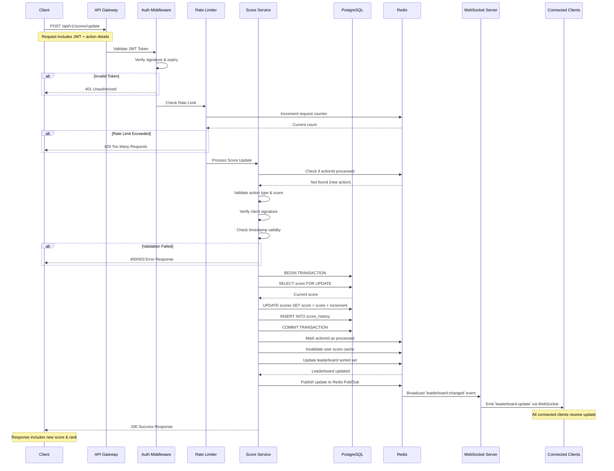

# Scoreboard Module - Technical Specification

## 1. Introduction

### Purpose
The Scoreboard Module is a backend service responsible for managing user scores and maintaining a real-time leaderboard that displays the top 10 users. The module handles score updates triggered by client-side actions, ensures data integrity through robust security measures, and broadcasts live updates to all connected clients.

### Key Objectives
- Process score update requests from authenticated clients
- Maintain an accurate, real-time leaderboard of top 10 users
- Prevent unauthorized score manipulation through multi-layered security
- Provide low-latency live updates to connected clients
- Scale efficiently to handle concurrent users

---

## 2. Architecture Overview

### Technology Stack
- **Runtime**: Node.js (v18+ recommended)
- **Web Framework**: Express.js
- **Database**: PostgreSQL (primary storage) + Redis (caching & pub/sub)
- **Real-time Communication**: WebSocket (Socket.IO)
- **Authentication**: JWT (JSON Web Tokens)
- **Rate Limiting**: Redis-based rate limiter

### Architecture Pattern
The module follows a layered architecture:

```
┌─────────────────────────────────────────┐
│         Client Applications             │
│    (Web, Mobile, Desktop clients)       │
└──────────────┬──────────────────────────┘
               │
               ├─── HTTP/REST API (Score Updates)
               └─── WebSocket (Live Updates)
               │
┌──────────────▼──────────────────────────┐
│         API Gateway Layer               │
│  • Authentication Middleware            │
│  • Rate Limiting                        │
│  • Request Validation                   │
└──────────────┬──────────────────────────┘
               │
┌──────────────▼──────────────────────────┐
│       Business Logic Layer              │
│  • Score Service                        │
│  • Validation Service                   │
│  • Leaderboard Service                  │
└──────────────┬──────────────────────────┘
               │
         ┌─────┴─────┐
         │           │
┌────────▼──────┐ ┌──▼─────────────┐
│  PostgreSQL   │ │     Redis      │
│  (Persistent) │ │  (Cache/PubSub)│
└───────────────┘ └────────────────┘
```

---

## 3. API Endpoints

### 3.1 Update Score
**Endpoint**: `POST /api/v1/scores/update`

**Description**: Increments a user's score upon completion of a valid action.

**Headers**:
```
Authorization: Bearer <JWT_TOKEN>
Content-Type: application/json
```

**Request Body**:
```json
{
  "actionId": "uuid-v4-string",
  "actionType": "TASK_COMPLETE",
  "scoreIncrement": 10,
  "timestamp": "2025-10-17T10:30:00Z",
  "clientSignature": "hmac-sha256-signature"
}
```

**Response** (200 OK):
```json
{
  "success": true,
  "data": {
    "userId": "user-123",
    "newScore": 1250,
    "previousScore": 1240,
    "rank": 5,
    "timestamp": "2025-10-17T10:30:01Z"
  }
}
```

**Error Responses**:
- `400 Bad Request`: Invalid request format or parameters
- `401 Unauthorized`: Missing or invalid JWT token
- `403 Forbidden`: Action verification failed (suspicious activity)
- `429 Too Many Requests`: Rate limit exceeded
- `500 Internal Server Error`: Server-side error

---

### 3.2 Get Leaderboard
**Endpoint**: `GET /api/v1/scores/leaderboard`

**Description**: Retrieves the current top 10 users.

**Headers**:
```
Authorization: Bearer <JWT_TOKEN> (optional for public leaderboards)
```

**Query Parameters**:
```
limit: number (default: 10, max: 100)
offset: number (default: 0)
```

**Response** (200 OK):
```json
{
  "success": true,
  "data": {
    "leaderboard": [
      {
        "rank": 1,
        "userId": "user-456",
        "username": "TopPlayer",
        "score": 5000,
        "lastUpdated": "2025-10-17T10:25:00Z"
      },
      // ... top 10 users
    ],
    "timestamp": "2025-10-17T10:30:00Z",
    "cacheHit": true
  }
}
```

---

### 3.3 Get User Score
**Endpoint**: `GET /api/v1/scores/user/:userId`

**Description**: Retrieves a specific user's score and rank.

**Headers**:
```
Authorization: Bearer <JWT_TOKEN>
```

**Response** (200 OK):
```json
{
  "success": true,
  "data": {
    "userId": "user-123",
    "username": "Player123",
    "score": 1250,
    "rank": 15,
    "lastUpdated": "2025-10-17T10:30:01Z"
  }
}
```

---

## 4. Data Models

### 4.1 Database Schema (PostgreSQL)

#### Users Table
```sql
CREATE TABLE users (
  id UUID PRIMARY KEY DEFAULT gen_random_uuid(),
  username VARCHAR(50) UNIQUE NOT NULL,
  email VARCHAR(255) UNIQUE NOT NULL,
  created_at TIMESTAMP DEFAULT CURRENT_TIMESTAMP,
  updated_at TIMESTAMP DEFAULT CURRENT_TIMESTAMP
);

CREATE INDEX idx_users_username ON users(username);
```

#### Scores Table
```sql
CREATE TABLE scores (
  id UUID PRIMARY KEY DEFAULT gen_random_uuid(),
  user_id UUID NOT NULL REFERENCES users(id) ON DELETE CASCADE,
  score BIGINT DEFAULT 0 NOT NULL,
  last_updated TIMESTAMP DEFAULT CURRENT_TIMESTAMP,
  UNIQUE(user_id)
);

CREATE INDEX idx_scores_score_desc ON scores(score DESC);
CREATE INDEX idx_scores_user_id ON scores(user_id);
```

#### Score History Table (Audit Trail)
```sql
CREATE TABLE score_history (
  id UUID PRIMARY KEY DEFAULT gen_random_uuid(),
  user_id UUID NOT NULL REFERENCES users(id) ON DELETE CASCADE,
  action_id UUID NOT NULL UNIQUE,
  action_type VARCHAR(50) NOT NULL,
  score_increment INTEGER NOT NULL,
  score_before BIGINT NOT NULL,
  score_after BIGINT NOT NULL,
  ip_address INET,
  user_agent TEXT,
  created_at TIMESTAMP DEFAULT CURRENT_TIMESTAMP
);

CREATE INDEX idx_score_history_user_id ON score_history(user_id);
CREATE INDEX idx_score_history_action_id ON score_history(action_id);
CREATE INDEX idx_score_history_created_at ON score_history(created_at DESC);
```

#### Suspicious Activity Table
```sql
CREATE TABLE suspicious_activity (
  id UUID PRIMARY KEY DEFAULT gen_random_uuid(),
  user_id UUID NOT NULL REFERENCES users(id),
  reason VARCHAR(255) NOT NULL,
  details JSONB,
  created_at TIMESTAMP DEFAULT CURRENT_TIMESTAMP
);

CREATE INDEX idx_suspicious_activity_user_id ON scores_history(user_id);
```

---

### 4.2 Redis Cache Structure

#### Leaderboard (Sorted Set)
```
Key: "leaderboard:top"
Type: Sorted Set (ZSET)
Members: user_id
Scores: user_score
TTL: None (persistent, updated on score changes)
```

#### User Score Cache
```
Key: "user:score:{userId}"
Type: Hash
Fields: {score, rank, lastUpdated, username}
TTL: 300 seconds (5 minutes)
```

#### Action ID Deduplication
```
Key: "action:processed:{actionId}"
Type: String
Value: user_id
TTL: 3600 seconds (1 hour)
```

#### Rate Limiting
```
Key: "ratelimit:score_update:{userId}"
Type: String
Value: request_count
TTL: 60 seconds
```

---

## 5. Security Measures

### 5.1 Authentication & Authorization
- **JWT Token Validation**: All requests must include a valid JWT token in the `Authorization` header
- **Token Contents**: JWT payload includes `userId`, `email`, `iat` (issued at), `exp` (expiration)
- **Token Expiry**: Tokens expire after 24 hours; refresh tokens mechanism recommended
- **Token Validation Middleware**: Verify signature, expiry, and token structure before processing requests

```javascript
// Example JWT payload
{
  "userId": "user-123",
  "email": "user@example.com",
  "iat": 1697539200,
  "exp": 1697625600
}
```

---

### 5.2 Action Validation & Anti-Cheat

#### Client Signature Verification
- Each score update request includes a `clientSignature` computed using HMAC-SHA256
- Signature is generated from: `actionId + actionType + scoreIncrement + timestamp + secretKey`
- Server recomputes signature and verifies match to prevent parameter tampering

#### Action ID Deduplication
- Each action has a unique `actionId` (UUID v4)
- Server checks Redis for previously processed `actionId`
- Prevents replay attacks where the same action is submitted multiple times

#### Score Increment Validation
- Server maintains a whitelist of valid `actionType` and corresponding max `scoreIncrement` values
- Reject requests with invalid action types or excessive score increments

```javascript
const VALID_ACTIONS = {
  'TASK_COMPLETE': { maxScore: 50, minDuration: 5000 },
  'LEVEL_UP': { maxScore: 100, minDuration: 30000 },
  'ACHIEVEMENT': { maxScore: 200, minDuration: 1000 }
};
```

#### Timestamp Validation
- Verify request timestamp is within acceptable range (e.g., ±5 minutes from server time)
- Prevents old or future-dated requests

#### Rate Limiting
- Per-user rate limits: 10 requests per minute
- Global rate limits: 1000 requests per minute across all users
- Uses Redis for distributed rate limiting in multi-instance deployments

```javascript
// Rate limiting configuration
{
  "scoreUpdate": {
    "perUser": { "max": 10, "window": 60000 },
    "global": { "max": 1000, "window": 60000 }
  }
}
```

---

### 5.3 Anomaly Detection

#### Statistical Analysis
- Track user score increase patterns over time
- Flag accounts with abnormal score growth rates (e.g., 10x average in short period)
- Implement z-score based outlier detection

#### Behavioral Patterns
- Monitor request frequency and timing patterns
- Detect bot-like behavior (e.g., perfectly consistent request intervals)
- Track IP address changes and geographic anomalies

#### Suspicious Activity Actions
1. Log event to `suspicious_activity` table
2. Send alert to monitoring system
3. Temporarily increase validation strictness for flagged user
4. Optional: Auto-freeze score updates pending manual review

---

### 5.4 Infrastructure Security
- **HTTPS Only**: All API endpoints must use TLS 1.3
- **CORS Configuration**: Restrict origins to known client domains
- **SQL Injection Prevention**: Use parameterized queries (pg library with prepared statements)
- **Input Sanitization**: Validate and sanitize all user inputs
- **DDoS Protection**: Implement Cloudflare or AWS Shield
- **Environment Variables**: Store secrets (JWT secret, DB credentials) in environment variables, never in code

---

## 6. Live Update Mechanism

### 6.1 WebSocket Implementation (Socket.IO)

#### Connection Flow
1. Client establishes WebSocket connection to `/socket.io`
2. Client sends authentication message with JWT token
3. Server validates JWT and associates connection with `userId`
4. Server subscribes client to `leaderboard` room

#### Event Types

**Server → Client Events**:
```javascript
// Leaderboard update (broadcast to all clients in room)
socket.emit('leaderboard:update', {
  leaderboard: [...top10Users],
  timestamp: '2025-10-17T10:30:01Z'
});

// User rank change notification (to specific user)
socket.emit('rank:changed', {
  userId: 'user-123',
  newRank: 8,
  oldRank: 12,
  newScore: 1250
});

// Score update acknowledgment
socket.emit('score:updated', {
  userId: 'user-123',
  newScore: 1250,
  increment: 10
});
```

---

### 6.2 Redis Pub/Sub Integration

In multi-instance deployments, use Redis Pub/Sub to broadcast updates across all server instances:

```javascript
// When score is updated on Instance A
redisPublisher.publish('leaderboard:changed', JSON.stringify({
  type: 'SCORE_UPDATE',
  userId: 'user-123',
  newScore: 1250,
  timestamp: Date.now()
}));

// All instances subscribe to this channel
redisSubscriber.subscribe('leaderboard:changed');
redisSubscriber.on('message', (channel, message) => {
  const update = JSON.parse(message);
  // Broadcast to all WebSocket clients connected to this instance
  io.to('leaderboard').emit('leaderboard:update', update);
});
```

---

### 6.3 Fallback: Polling Strategy

For clients that cannot maintain WebSocket connections:

**Endpoint**: `GET /api/v1/scores/leaderboard/changes`

**Query Parameters**:
```
since: timestamp (ISO 8601)
```

**Response**:
```json
{
  "success": true,
  "data": {
    "hasChanges": true,
    "leaderboard": [...top10Users],
    "lastUpdated": "2025-10-17T10:30:01Z"
  }
}
```

**Polling Frequency**: Recommended 5-10 seconds for optimal balance

---

## 7. Error Handling & Edge Cases

### 7.1 Error Response Format

All errors follow a consistent structure:

```json
{
  "success": false,
  "error": {
    "code": "INVALID_ACTION",
    "message": "The provided action type is not recognized",
    "details": {
      "actionType": "UNKNOWN_ACTION"
    },
    "timestamp": "2025-10-17T10:30:01Z"
  }
}
```

---

### 7.2 Error Codes

| Code | HTTP Status | Description |
|------|-------------|-------------|
| `UNAUTHORIZED` | 401 | Missing or invalid JWT token |
| `FORBIDDEN` | 403 | Action verification failed |
| `INVALID_REQUEST` | 400 | Malformed request body |
| `INVALID_ACTION` | 400 | Unknown action type |
| `DUPLICATE_ACTION` | 409 | Action ID already processed |
| `RATE_LIMIT_EXCEEDED` | 429 | Too many requests |
| `SCORE_VALIDATION_FAILED` | 400 | Score increment exceeds maximum |
| `TIMESTAMP_OUT_OF_RANGE` | 400 | Request timestamp invalid |
| `DATABASE_ERROR` | 500 | Database operation failed |
| `CACHE_ERROR` | 500 | Redis operation failed |

---

### 7.3 Edge Cases

#### Concurrent Score Updates
- **Problem**: Multiple requests for same user arrive simultaneously
- **Solution**: Use database transactions with row-level locking (`SELECT ... FOR UPDATE`)

```sql
BEGIN TRANSACTION;
SELECT score FROM scores WHERE user_id = $1 FOR UPDATE;
-- Perform validation
UPDATE scores SET score = score + $2 WHERE user_id = $1;
COMMIT;
```

#### Cache Inconsistency
- **Problem**: Redis cache out of sync with PostgreSQL
- **Solution**: 
  - Implement cache-aside pattern with TTL
  - Invalidate cache on updates, lazy reload on read
  - Periodic cache refresh job (every 5 minutes)

#### Leaderboard Ties
- **Problem**: Multiple users with identical scores
- **Solution**: Use secondary sort by `last_updated` timestamp (earlier timestamp ranks higher)

#### Database Connection Failures
- **Problem**: PostgreSQL becomes unavailable
- **Solution**:
  - Implement connection pooling with retry logic
  - Queue score updates in Redis with TTL
  - Process queued updates when database recovers
  - Return `503 Service Unavailable` to client with retry-after header

#### WebSocket Disconnections
- **Problem**: Network interruption causes WebSocket disconnect
- **Solution**:
  - Implement automatic reconnection with exponential backoff
  - Send sequence numbers with updates to detect missed messages
  - On reconnect, fetch latest leaderboard state

---

## 8. Deployment & Configuration

### 8.1 Environment Variables

```bash
# Application
NODE_ENV=production
PORT=3000
API_VERSION=v1

# JWT Authentication
JWT_SECRET=your-256-bit-secret
JWT_EXPIRY=24h

# PostgreSQL
DB_HOST=localhost
DB_PORT=5432
DB_NAME=scoreboard
DB_USER=dbuser
DB_PASSWORD=dbpassword
DB_POOL_SIZE=20

# Redis
REDIS_HOST=localhost
REDIS_PORT=6379
REDIS_PASSWORD=redispassword
REDIS_DB=0

# Rate Limiting
RATE_LIMIT_WINDOW_MS=60000
RATE_LIMIT_MAX_REQUESTS=10

# Security
HMAC_SECRET_KEY=your-hmac-secret
CORS_ORIGINS=https://yourdomain.com,https://app.yourdomain.com

# Monitoring
LOG_LEVEL=info
SENTRY_DSN=your-sentry-dsn
```

---

### 8.2 Docker Deployment

#### Dockerfile
```dockerfile
FROM node:18-alpine

WORKDIR /app

COPY package*.json ./
RUN npm ci --only=production

COPY . .

EXPOSE 3000

CMD ["node", "src/index.js"]
```

#### docker-compose.yml
```yaml
version: '3.8'

services:
  api:
    build: .
    ports:
      - "3000:3000"
    environment:
      - NODE_ENV=production
      - DB_HOST=postgres
      - REDIS_HOST=redis
    depends_on:
      - postgres
      - redis
    restart: unless-stopped

  postgres:
    image: postgres:15-alpine
    environment:
      POSTGRES_DB: scoreboard
      POSTGRES_USER: dbuser
      POSTGRES_PASSWORD: dbpassword
    volumes:
      - postgres_data:/var/lib/postgresql/data
    ports:
      - "5432:5432"

  redis:
    image: redis:7-alpine
    command: redis-server --requirepass redispassword
    volumes:
      - redis_data:/data
    ports:
      - "6379:6379"

volumes:
  postgres_data:
  redis_data:
```

---

### 8.3 Health Check Endpoints

**Endpoint**: `GET /health`

**Response**:
```json
{
  "status": "healthy",
  "timestamp": "2025-10-17T10:30:01Z",
  "services": {
    "database": "connected",
    "redis": "connected",
    "websocket": "active"
  },
  "uptime": 86400
}
```

---

### 8.4 Scaling Considerations

#### Horizontal Scaling
- Run multiple API instances behind load balancer (NGINX, AWS ALB)
- Use Redis Pub/Sub to sync WebSocket broadcasts across instances
- Ensure session affinity for WebSocket connections (sticky sessions)

#### Database Scaling
- Implement read replicas for leaderboard queries
- Use connection pooling (pg-pool)
- Consider sharding by user ID for massive scale

#### Redis Scaling
- Use Redis Cluster for high availability
- Separate cache and pub/sub into different Redis instances for isolation

---

## 9. Testing Guidelines

### 9.1 Unit Tests

Test individual components in isolation:

```javascript
// Example: Score validation service test
describe('ScoreValidationService', () => {
  test('should reject invalid action types', async () => {
    const result = await validateScoreUpdate({
      actionType: 'INVALID_ACTION',
      scoreIncrement: 10
    });
    expect(result.isValid).toBe(false);
    expect(result.error).toBe('INVALID_ACTION');
  });

  test('should reject excessive score increments', async () => {
    const result = await validateScoreUpdate({
      actionType: 'TASK_COMPLETE',
      scoreIncrement: 1000 // exceeds max of 50
    });
    expect(result.isValid).toBe(false);
  });
});
```

**Coverage Requirements**: Minimum 80% code coverage

---

### 9.2 Integration Tests

Test API endpoints with real database and Redis:

```javascript
describe('POST /api/v1/scores/update', () => {
  test('should update score with valid request', async () => {
    const response = await request(app)
      .post('/api/v1/scores/update')
      .set('Authorization', `Bearer ${validToken}`)
      .send({
        actionId: uuidv4(),
        actionType: 'TASK_COMPLETE',
        scoreIncrement: 10,
        timestamp: new Date().toISOString(),
        clientSignature: computeSignature(...)
      });

    expect(response.status).toBe(200);
    expect(response.body.success).toBe(true);
    expect(response.body.data.newScore).toBeGreaterThan(0);
  });

  test('should reject duplicate action IDs', async () => {
    const actionId = uuidv4();
    // First request
    await request(app).post('/api/v1/scores/update')...;
    
    // Duplicate request
    const response = await request(app)
      .post('/api/v1/scores/update')...;

    expect(response.status).toBe(409);
    expect(response.body.error.code).toBe('DUPLICATE_ACTION');
  });
});
```

---

### 9.3 Load Testing

Use tools like Apache JMeter or k6:

```javascript
// k6 load test script
import http from 'k6/http';
import { check } from 'k6';

export let options = {
  stages: [
    { duration: '2m', target: 100 }, // Ramp up to 100 users
    { duration: '5m', target: 100 }, // Stay at 100 users
    { duration: '2m', target: 0 },   // Ramp down
  ],
};

export default function () {
  const payload = JSON.stringify({
    actionId: generateUUID(),
    actionType: 'TASK_COMPLETE',
    scoreIncrement: 10,
    timestamp: new Date().toISOString(),
    clientSignature: computeSignature()
  });

  const response = http.post(
    'http://localhost:3000/api/v1/scores/update',
    payload,
    { headers: { 'Authorization': `Bearer ${token}` } }
  );

  check(response, {
    'status is 200': (r) => r.status === 200,
    'response time < 200ms': (r) => r.timings.duration < 200,
  });
}
```

**Performance Targets**:
- P95 response time < 200ms
- Throughput: 1000 requests/second
- WebSocket concurrent connections: 10,000+

---

### 9.4 Security Testing

- **Penetration Testing**: Attempt JWT forgery, SQL injection, XSS
- **Rate Limit Testing**: Verify rate limits are enforced correctly
- **Replay Attack Testing**: Attempt to reuse action IDs
- **Parameter Tampering**: Modify score increments in requests

---

## 10. Monitoring & Observability

### 10.1 Logging

Use structured logging (Winston or Pino):

```javascript
logger.info('Score updated', {
  userId: 'user-123',
  actionType: 'TASK_COMPLETE',
  scoreIncrement: 10,
  newScore: 1250,
  duration: 45,
  timestamp: new Date().toISOString()
});
```

**Log Levels**:
- `error`: Critical failures requiring immediate attention
- `warn`: Suspicious activity, validation failures
- `info`: Successful operations, score updates
- `debug`: Detailed debugging information (dev only)

---

### 10.2 Metrics

Track key performance indicators:

- **Business Metrics**:
  - Total score updates per minute
  - Unique active users per hour
  - Average score increment
  - Leaderboard position changes

- **Technical Metrics**:
  - API response times (P50, P95, P99)
  - Database query latency
  - Redis operation latency
  - WebSocket connection count
  - Error rate by error code
  - Rate limit hits

**Tools**: Prometheus + Grafana, DataDog, New Relic

---

### 10.3 Alerting

Configure alerts for:

- Error rate > 1% for 5 minutes
- P95 response time > 500ms for 5 minutes
- Database connection pool exhaustion
- Redis unavailable
- Suspicious activity spike (>100 events/hour)
- Disk space < 10% on database server

---

## 11. Execution Flow Diagram



---

## 12. Additional Comments & Future Improvements

### 12.1 Scalability Enhancements

#### Database Optimizations
- **Materialized Views**: Create materialized view for top 100 leaderboard, refresh every 30 seconds
- **Partitioning**: Partition `score_history` table by date for improved query performance
- **Archive Strategy**: Move score history older than 6 months to cold storage (S3/Glacier)

#### Caching Strategy
- **CDN Caching**: Cache public leaderboard at edge locations (CloudFront, Cloudflare)
- **Local Memory Cache**: Add in-memory cache (LRU) before Redis to reduce network calls
- **Cache Warming**: Pre-populate cache on deployment with top leaderboards

#### Geographic Distribution
- **Multi-Region Deployment**: Deploy API servers in multiple AWS regions
- **Database Replication**: Use PostgreSQL streaming replication across regions
- **Regional Leaderboards**: Implement per-region leaderboards for lower latency

---

### 12.2 Advanced Anti-Cheat Mechanisms

#### Machine Learning-Based Detection
- Train ML model on historical score update patterns
- Detect anomalies in real-time using TensorFlow.js or similar
- Flag accounts with deviation scores above threshold

#### Action Verification with Zero-Knowledge Proofs
- Implement cryptographic proofs that action was completed client-side
- Prevents server-side score manipulation even with compromised credentials

#### Device Fingerprinting
- Track unique device identifiers (fingerprints)
- Flag accounts accessed from excessive number of devices
- Implement device-based rate limiting

#### Temporal Analysis
- Track time between actions to detect impossible sequences
- Require minimum time between score updates based on action type

---

### 12.3 Feature Enhancements

#### Extended Leaderboards
- **Pagination**: Support fetching top 100, 1000 users with efficient pagination
- **Time-Based Leaderboards**: Daily, weekly, monthly, all-time leaderboards
- **Category Leaderboards**: Separate leaderboards by game mode, difficulty, region

#### Social Features
- **Friend Leaderboards**: Show ranking among user's friends
- **Achievements & Badges**: Award badges for milestones (Top 10, 1000+ score)
- **Score Challenges**: Time-limited competitions with separate leaderboards

#### Analytics Dashboard
- Admin dashboard showing:
  - Real-time score update graphs
  - User growth metrics
  - Suspicious activity feed
  - Performance metrics

---

### 12.4 Performance Optimizations

#### Batch Processing
- Batch multiple score updates from same user within 1-second window
- Reduces database writes and improves throughput

#### Lazy Rank Calculation
- Don't calculate exact rank for users outside top 1000
- Show approximate rank (e.g., "Top 10%", "Top 25%")

#### WebSocket Connection Pooling
- Implement connection pooling for WebSocket server
- Use sticky sessions based on user ID for better caching

#### Database Query Optimization
- Add composite indexes for common query patterns
- Use EXPLAIN ANALYZE to identify slow queries
- Implement query result caching with TTL

---

### 12.5 Compliance & Privacy

#### GDPR Compliance
- Implement right to be forgotten (delete user data)
- Data export functionality for user data
- Consent management for data processing

#### Audit Trail
- Maintain comprehensive audit logs for all score changes
- Log retention policy (minimum 90 days, configurable)
- Provide audit trail API for compliance reviews

---

### 12.6 Monitoring Improvements

#### Distributed Tracing
- Implement OpenTelemetry for end-to-end request tracing
- Track request flow across services (API → DB → Cache → WebSocket)

#### Real-Time Anomaly Detection
- Integrate with AWS CloudWatch Anomaly Detection or similar
- Automatically detect unusual patterns in metrics

#### Business Intelligence
- Export metrics to data warehouse (Snowflake, BigQuery)
- Create dashboards for business stakeholders

---

### 12.7 Disaster Recovery

#### Backup Strategy
- Automated daily PostgreSQL backups to S3
- Point-in-time recovery capability (PITR)
- Regular restore testing (monthly)

#### Failover Mechanisms
- Multi-AZ database deployment for high availability
- Automatic failover with minimal downtime (RDS Multi-AZ)
- Redis Sentinel for automatic cache failover

#### Incident Response Plan
- Documented runbooks for common incidents
- On-call rotation schedule
- Post-mortem process for outages

---

## 13. Conclusion

This specification provides a comprehensive foundation for implementing a secure, scalable, and real-time scoreboard module. The architecture emphasizes security through multi-layered validation, performance through intelligent caching, and reliability through robust error handling.

Key success factors:
- ✅ Multi-layered security prevents unauthorized score manipulation
- ✅ Real-time updates provide engaging user experience
- ✅ Horizontal scalability supports growth
- ✅ Comprehensive monitoring enables proactive issue resolution
- ✅ Extensible design allows future enhancements

### Next Steps for Implementation
1. Set up development environment with PostgreSQL and Redis
2. Implement core API endpoints with authentication
3. Develop score validation and update logic
4. Integrate WebSocket server for live updates
5. Implement security measures (rate limiting, signature verification)
6. Write comprehensive test suite
7. Set up monitoring and alerting
8. Conduct load testing and security audit
9. Deploy to staging environment
10. Production rollout with gradual traffic increase

---

**Document Version**: 1.0  
**Last Updated**: October 17, 2025  
**Author**: Backend Architecture Team  
**Review Status**: Ready for Implementation